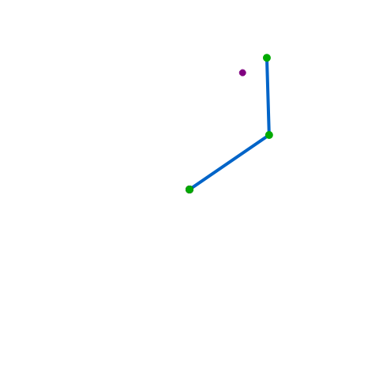
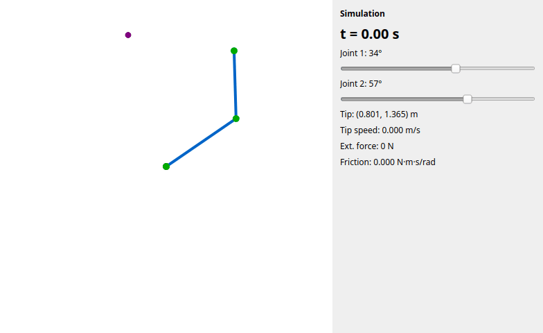
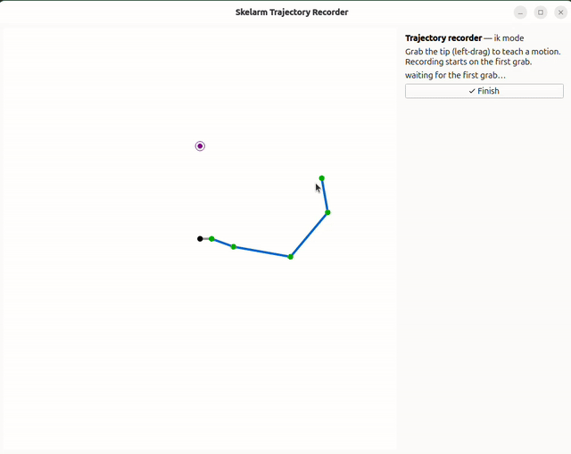

# skelarm

A lightweight, physics-based dynamics simulator for a configurable planar robot
arm. `skelarm` treats the robot as a "skeleton" of N links and focuses on
kinematics and dynamics simulation — there is no collision detection or detailed
shape rendering, and the supported model is a **horizontal, gravity-free plane**.
Define a robot in TOML, pose it interactively, simulate it under torque control,
run controlled tasks from a single scenario file, and record every run to a
self-contained log that replays, plots, and exports to video.

Full documentation: **<https://hrshtst.github.io/skelarm/>**



## Quick start

Requires Python 3.12+ and [`uv`](https://docs.astral.sh/uv/) (plain
`pip install .` also works):

```bash
git clone https://github.com/hrshtst/skelarm.git
cd skelarm
uv sync
```

Three commands, from posing to a controlled reach:

```bash
# 1. Pose a 4-DOF arm: joint sliders (FK) or drag the tip (IK)
uv run python tools/kinematics_inspector.py examples/four_dof_robot.toml

# 2. Simulate its dynamics: press Space to run, drag the tip to apply a force
uv run python tools/dynamics_simulator.py examples/four_dof_robot.toml

# 3. Run a controlled reach: the controller drives the arm to the target
uv run python tools/reaching_simulator.py examples/reach.toml
```

Every simulator records its run — press **Export…** to save a `*.sklog.npz` log
and replay it with `uv run python tools/player.py <log>`. See
[Getting Started](docs/getting_started.md) for the guided version.

## Capabilities

From basic to advanced:

- **Configurable robot** — arbitrary planar chains from TOML: link lengths,
  masses, inertias, centers of mass, joint limits, optional base offset
  ([guide](docs/guides/robot_configuration.md)).
- **Kinematics** — recursive forward kinematics (positions, velocities,
  accelerations), endpoint Jacobian, and numerical inverse kinematics
  (Sugihara-style Levenberg-Marquardt and friends)
  ([guide](docs/guides/kinematics_and_posing.md)).
- **Dynamics** — Recursive Newton-Euler inverse dynamics and mass-matrix forward
  dynamics; fixed-step semi-implicit Euler and adaptive `solve_ivp` integration;
  gravity is explicitly zero (horizontal plane)
  ([guide](docs/guides/simulate_dynamics.md)).
- **Tasks & control** — reaching, multi-target reaching, periodic curve tracing,
  and trajectory tracking, driven by trajectory-tracking laws, human-like
  reaching controllers, or joint-space MPC — all from one scenario TOML,
  extensible at runtime ([guide](docs/guides/running_scenarios.md)).
- **Trajectory tools** — teach motions by dragging the tip, then smooth
  (zero-phase filters), resample (from-scratch interpolators), and track them
  ([guide](docs/guides/teaching_trajectories.md)).
- **Recording & replay** — self-contained `*.sklog.npz` logs with an analysis
  player, headless `.mp4`/`.gif` export, and reproducible headless
  re-simulation ([guide](docs/guides/recording_replay.md)).

## Choose a workflow

| I want to… | Run | Guide |
| --- | --- | --- |
| Pose or inspect an arm | `tools/kinematics_inspector.py <robot.toml>` | [Kinematics and Posing](docs/guides/kinematics_and_posing.md) |
| Simulate free dynamics | `tools/dynamics_simulator.py <robot.toml>` | [Simulate Dynamics](docs/guides/simulate_dynamics.md) |
| Run a controlled task | `tools/reaching_simulator.py <scenario.toml>` | [Run Controlled Scenarios](docs/guides/running_scenarios.md) |
| Replay / export a run | `tools/player.py <run.sklog.npz>` | [Record, Replay, and Re-simulate](docs/guides/recording_replay.md) |
| Teach and track a trajectory | `tools/trajectory_recorder.py <robot.toml>` | [Teach and Track Trajectories](docs/guides/teaching_trajectories.md) |
| Use the Python API | — | [Python API Quick Start](docs/guides/python_api.md) |

## Demos

<table>
  <tr>
    <td width="50%"></td>
    <td width="50%"></td>
  </tr>
  <tr>
    <td align="center">Disturbing a controlled reach — the drag force is recorded and replayed</td>
    <td align="center">Teaching a trajectory by demonstration</td>
  </tr>
</table>

More demos — live target switching, curve tracing, MPC, and the tracked playback
of the taught motion — are embedded as smaller MP4 videos throughout the
[documentation](https://hrshtst.github.io/skelarm/).

## Minimal Python example

```python
from skelarm import load_scenario, rerun_log, run_scenario

scenario = load_scenario("examples/reach.toml")
log = run_scenario(scenario)  # headless controlled run
log.save("reach.sklog.npz")  # replay with tools/player.py
again = rerun_log(log)  # deterministic re-simulation from the embedded config
```

Lower-level building blocks (`Skeleton`, FK/IK, forward/inverse dynamics,
`simulate_robot`) are covered in the
[Python API Quick Start](docs/guides/python_api.md).

## Documentation

- [Getting Started](docs/getting_started.md)
- [User Guides](https://hrshtst.github.io/skelarm/guides/robot_configuration/) —
  configuration, simulation, scenarios, recording, joint limits, and the
  [tool & CLI reference](docs/guides/tools_reference.md)
- [Theory Reference](docs/reference/index.md) — the mathematics behind the
  implementation
- [API Reference](https://hrshtst.github.io/skelarm/api/skeleton/) — generated
  from the source
- [Developer Guides](docs/guides/development.md) — extending tasks/controllers,
  architecture, development workflow

## For developers

```bash
uv sync --all-extras && uv run pre-commit install
make all          # format + type-check + test — run before declaring a change done
make docs-serve   # preview the documentation site
```

Development is test-first (`pytest` + `hypothesis` property tests), fully typed
(`basedpyright` + `mypy`), and linted with `ruff`. See
[Development and Testing](docs/guides/development.md) for the workflow and
[Architecture](docs/api/architecture.md) for how the modules fit together.

## License

GPLv3

## AI Assistance & Development Workflow

This project is developed with the assistance of AI coding agents: the
maintainer ([@hrshtst](https://github.com/hrshtst)) writes the project
guidance and theoretical reference material, the AI implements against them, and
the maintainer reviews, tests, and revises every change. All responsibility for
the code in this repository lies with the maintainer.

External contributors are welcome to use AI tools under the same standard: if
you use AI to generate code for a pull request, **disclose it in the PR
description** and ensure you have thoroughly reviewed and tested the code. If
you identify problems, or find code that appears to be unoriginal or
rights-protected, please notify the maintainer by filing an issue. The full
workflow is described in
[Development and Testing](docs/guides/development.md).
