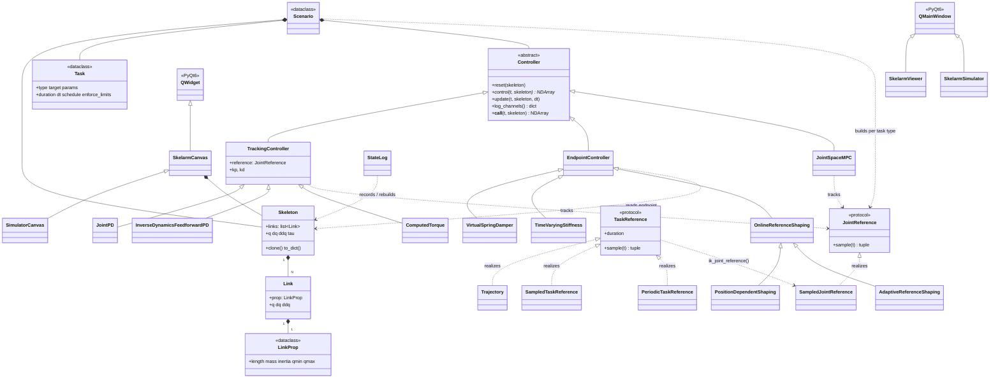

# Architecture

This page maps the `skelarm` class structure: how the robot model, the
controllers, the configuration glue, and the PyQt6 GUI relate to one another. It
complements the per-module API pages (starting with [Skeleton](skeleton.md)) and
the theory chapters that derive each piece.

The codebase has five structures worth seeing together:

- the **robot model** (`Skeleton` / `Link` / `LinkProp`);
- the **controller** hierarchy (the trackers of
  [Trajectory Tracking Control](../reference/07_control.md) and the endpoint
  controllers of [Reaching Control](../reference/08_reaching_control.md));
- the **task / joint references** the controllers track (`TaskReference` /
  `JointReference` protocols and their realizations);
- the **scenario glue** that turns a TOML config into a runnable controller;
- the **PyQt6 GUI** widgets and windows.

*Click the diagram to enlarge it; click anywhere, the × button, or press Esc to
close.*

## Robot model

[`Skeleton`](skeleton.md) owns the ordered list of `Link` objects (`links[0]` is
the fixed base; `links[1:]` are the actuated joints), and each `Link` holds an
immutable `LinkProp` dataclass with its geometry, mass properties, and joint
limits. The kinematics and dynamics functions operate on a `Skeleton`, and the
controllers below read endpoint state from it each step.

## Controllers

Every controller derives from the abstract [`Controller`](control.md), which is
callable as `f(t, skeleton) -> tau` and exposes the `reset` / `control` /
`update` / `log_channels` hooks used by the fixed-step `simulate_controlled`
loop. Two families sit beneath it:

- [`TrackingController`](control.md) tracks a joint reference and logs the
  reference and error; `JointPD`, `InverseDynamicsFeedforwardPD`, and
  `ComputedTorque` are its concrete trackers.
- [`EndpointController`](reaching.md) implements the shared task-space
  spring-damper law; `VirtualSpringDamper`, `TimeVaryingStiffness`, and
  `OnlineReferenceShaping` extend it, and `PositionDependentShaping` /
  `AdaptiveReferenceShaping` further specialize the online shaper.

[`JointSpaceMPC`](mpc.md) derives from `Controller` directly rather than from
`TrackingController`, because it consumes the joint reference through the
optimizer rather than through a PD law.

The trackers and MPC read a joint reference through the `JointReference`
[`Protocol`](control.md). `SampledJointReference` satisfies it structurally (it
is not an explicit subclass), so any object with a matching `sample(t)` method
can serve as a reference.

## Task references

A task-space reference is anything satisfying the `TaskReference` `Protocol`
(`sample(t)` plus a `duration`): a planned [`Trajectory`](trajectory.md), a
`SampledTaskReference` (a smoothed/interpolated recorded tip path), or a
[`PeriodicTaskReference`](curves.md) (a closed curve). `ik_joint_reference`
converts any of them into a `SampledJointReference` by samplewise inverse
kinematics, so the trackers and MPC need no knowledge of where the reference came
from. The [Trajectory Filtering & Interpolation](../reference/09_trajectory_filtering.md)
chapter covers the smoothing (`skelarm.filtering`) and resampling
(`skelarm.interpolation`) applied to recorded references.

## Scenario glue

[`Scenario`](scenario.md) is the runnable bundle assembled from one TOML file: a
`Skeleton`, a `Task` (its required `type` plus the target / run conditions /
type-specific `params`), and a ready-to-run `Controller`. The loader builds the
joint reference for the trackers by **dispatching on the task type** (a registry
opened by `register_reference_builder`): `reaching` plans a point-to-point
`Trajectory`, `periodic_curve` builds a `PeriodicTaskReference`, and the
trajectory-tracking tasks load a recorded reference — each converted via
`ik_joint_reference`, except `joint_trajectory_tracking`, which yields a
`SampledJointReference` directly. See the
[Control Configuration](../guides/control_configuration.md) and
[Defining a Task](../guides/defining_a_task.md) guides for the config schema.

## PyQt6 GUI

The interactive tools subclass PyQt6 base classes. [`SkelarmCanvas`](canvas.md)
(a `QWidget`) renders a `Skeleton` and is extended by
[`SimulatorCanvas`](simulator.md); `SkelarmViewer` and `SkelarmSimulator` are the
`QMainWindow` shells that host them.

!!! note "Value types not shown"
    A few standalone value types are omitted from the diagram to keep it
    readable: `IKResult` (returned by `compute_inverse_kinematics`) and
    [`StateLog`](recording.md) (the recorded run produced by `simulate_controlled`
    and by the interactive simulators).
