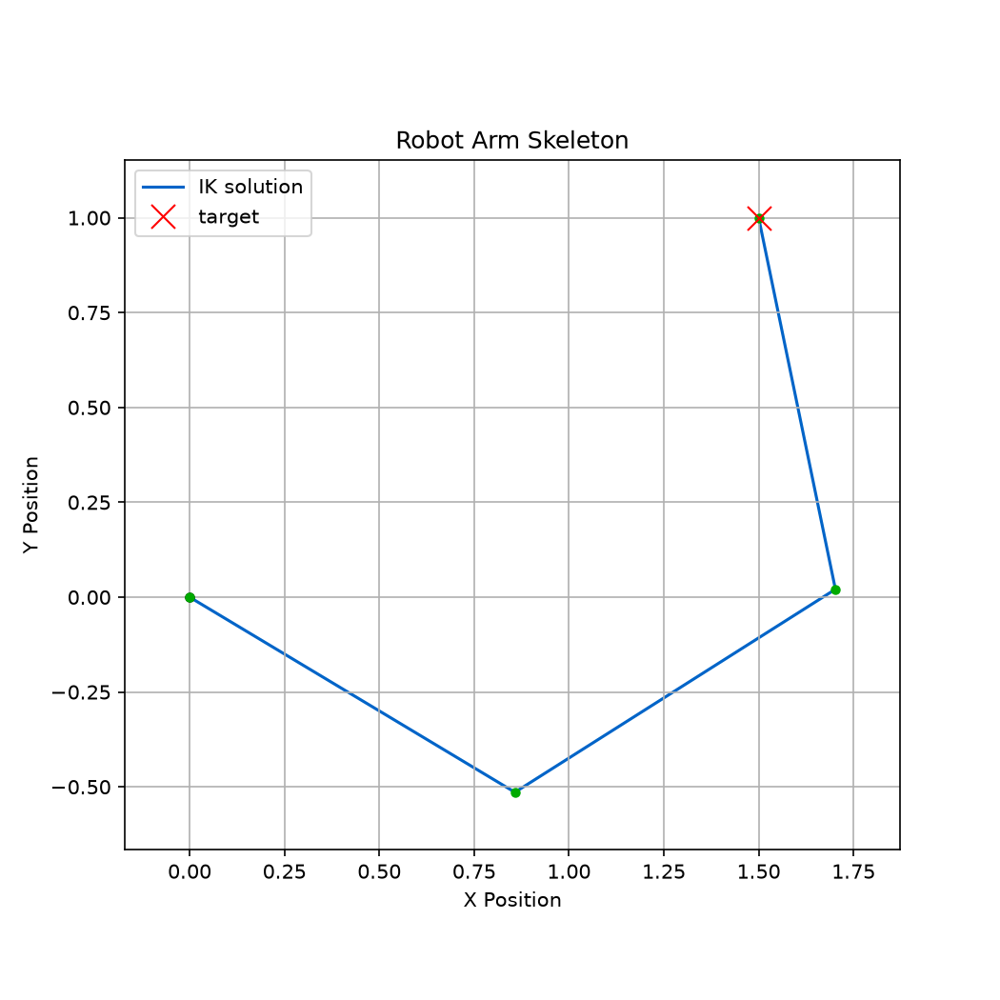

# Kinematics and Posing

Pose a robot interactively, solve inverse kinematics, and plot poses from
scripts — no dynamics involved.

## Inspect a robot interactively

The kinematics inspector poses any configured arm with joint sliders (forward
kinematics) or by clicking/dragging the tip in the canvas (inverse kinematics):

```bash
uv run python tools/kinematics_inspector.py examples/four_dof_robot.toml
```

Useful flags: `--method <ik-method>` selects the IK solver, `--show-com` draws
the link centers of mass, and the start pose comes from `--pose 20,45,60,30`
(degrees) or `--initial pose.toml` (a TOML file with an `[initial]` table).
Press `R` to reset the pose and `Q` to quit (see the
[tool reference](tools_reference.md) for all shortcuts).

<video controls loop muted playsinline width="640" src="../../assets/kinematics_posing_demo.mp4"></video>

Dragging the tip runs the numerical IK solver each move; joint limits clamp the
solution, so the arm stops at its bounds rather than folding through them
([Joint Limits](joint_limits.md)).

In a PyQt6 tool of your own, the [`SkelarmCanvas`](../api/canvas.md) widget poses
the arm on a click or drag the same way. Set its `drag_to_pose` attribute to
`False` to switch that off, for example while the tool animates the arm.

## Scripted kinematics and plotting

For a minimal scripted example that defines a robot, computes forward
kinematics, and plots the pose with Matplotlib:

```bash
uv run python examples/basic_plotting.py
```

Solve endpoint inverse kinematics (default: Sugihara-style Levenberg-Marquardt)
and plot the solved pose:

```bash
uv run python examples/inverse_kinematics.py
```



A self-contained interactive example without the config-file tooling:

```bash
uv run python examples/interactive_kinematics.py
```

## From Python

```python
from skelarm import Skeleton, compute_forward_kinematics, compute_inverse_kinematics

skeleton = Skeleton.from_toml("examples/four_dof_robot.toml")
compute_forward_kinematics(skeleton)
tip = skeleton.links[-1]
print(tip.xe, tip.ye)  # endpoint position

result = compute_inverse_kinematics(skeleton, [0.8, 1.2])
print(result.success, result.residual_norm)
```

`compute_inverse_kinematics` writes the best-effort pose back to the skeleton
and reports `success` strictly as *residual within tolerance* — check it (or
`residual_norm`) before trusting that a target was reached. The methods and
their convergence behavior are covered in
[Numerical Inverse Kinematics](../reference/06_numerical_inverse_kinematics.md).

## Related

- [Robot Configuration](robot_configuration.md) — the `[skeleton]` / `[initial]`
  schema.
- [Simulate Dynamics](simulate_dynamics.md) — put the same robot under physics.
- [Kinematics](../reference/01_kinematics.md) and
  [Differential Kinematics](../reference/02_differential_kinematics.md) — the
  theory.
