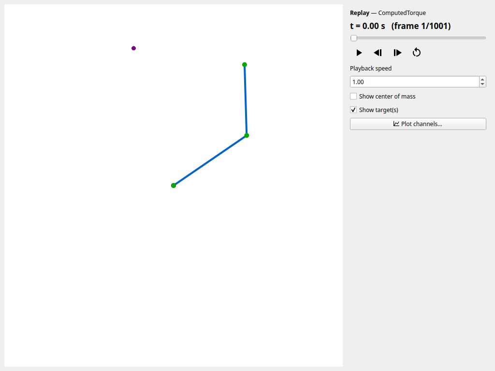

# Record, Replay, and Re-simulate

Every simulator records its run to a self-contained `*.sklog.npz` **state log**:
the robot geometry, the recorded channels (joint angles, velocities, torques,
external tip force, viscous friction — plus the live active-target index in the
multi-target simulator), and — for scenario runs — the full scenario config and
resolved run settings. This guide covers what you can do with a log: replay it,
plot it, export it to video, and re-simulate it.

## Replay in the player

```bash
uv run python tools/player.py run.sklog.npz
```

The motion is reconstructed and animated from the log *without* re-running the
dynamics. Scrub the timeline and drive playback from the transport bar (`Space`
play/pause, `←`/`B` and `→`/`F` previous/next frame while paused, `R`/`Home`
back to start, `End` last frame) at a chosen speed (`--speed`), toggle the
centers of mass (`--show-com`), and open per-channel plots with **Plot
channels…**. A recorded external tip force is drawn as a red arrow (**Show
external force**). When the log embeds a task (any scenario simulator records
it), the player draws the task context — the target (the active one emphasized
for multi-target tasks), the periodic curve, or the reference trajectory — each
toggled with **Show target(s)** / **Show reference**. A multi-target recording
carries the live active-target index, so the emphasized marker follows the
switches you made during the run.



### Play several logs

Give several logs to replay them as a playlist, for example the takes of a
recording session:

```bash
uv run python tools/player.py reach_*.sklog.npz
```

The playlist is docked on the right of the player — the window widens to make
room — and lists the files by name (hover for the full path). Its title-bar
button floats it as a window of its own, and you can dock it back on either
side. Double-click a file — or select it and press `Enter` — to load and play
it. When a log finishes, the next file plays, and the end of the list stops.
`N` / `P` load the next / previous file, keeping playback running if it was;
they and the other player keys (`Space`, …) work while the list has the focus.
The side panel and the window title name the playing file, **Plot channels…**
plots that file, and your speed and overlay toggles carry over from file to
file. A file that cannot be replayed is greyed out with the reason and skipped.
The **Playlist** button (or the dock's close button) hides the playlist, and the
button shows it again; the window narrows and widens with it (and when you float
the playlist off or dock it back), so the canvas and side panel keep their size —
except in a maximized or full-screen window, whose size the desktop decides.
Closing the player closes the playlist too. `--export` renders a
single log, so export each file separately.

## Export to video

Pass `--export PATH` to render the replay headlessly to a video or animated GIF
— the format comes from the extension, each frame is drawn by the same canvas
(task overlay, centers of mass, and force arrow included), and `--fps` sets the
output frame rate (`--speed` and `--show-com` apply too):

```bash
uv run python tools/player.py run.sklog.npz --export run.mp4            # headless mp4
uv run python tools/player.py run.sklog.npz --export run.gif --fps 24   # headless animated gif
```

Add `--panel` to composite a simulator-style side panel into each frame: the
time readout, per-joint sliders, tip position and speed, and the recorded
parameter readouts (external-force magnitude, viscous friction, active target)
where the log carries those channels. A sample panel export:

<video controls loop muted playsinline width="640" src="../../assets/periodic_curve.mp4"></video>

## The three reproducibility tiers

"Reproducible" means different things for different run types. Three tiers, from
strongest to weakest:

1. **Recorded-state playback** — every saved log replays in the player and
   plots/exports exactly as recorded. This always works: the channels *are* the
   run.
2. **Deterministic headless re-simulation** — a `run_scenario` log can be
   re-simulated with `rerun_log`. The deterministic controllers reproduce the
   recorded channels exactly; MPC matches within a small numerical tolerance
   (details below).
3. **Interactive (GUI) runs** — a GUI recording carries the same config and
   resolved settings, but mouse-drag tip forces, any GUI friction, and live
   target switches in the multi-target simulator shaped the recorded motion and
   are **not replayed** by `rerun_log`: a re-simulation gives the *unperturbed*
   scenario with the configured active target, not the recorded motion. Use
   playback (tier 1) to revisit such a run; the drag force is recorded as the
   `ext_force` channel and the switches as the `active_target` channel for
   analysis.

A log written by `run_scenario` or the interactive scenario simulators embeds —
in the log's `[extra]` metadata — the **resolved, self-contained scenario
config** (the full `[skeleton]` / `[initial]` / `[task]` / `[simulator]` /
`[controller]` tables as the run actually used them: section overrides are
merged in, and a tracking task's file-based reference samples are inlined so the
log needs no other file), the resolved run parameters (`dt` / `grav_vec` /
`enforce_limits`, plus `duration` for headless runs — a GUI run is open-ended,
so its log records no duration and a re-run falls back to the task's), and the
`skelarm` / `numpy` / `scipy` versions. `enforce_limits` records the *resolved*
joint-limit choice, so a `--no-joint-limits` override is reproduced on re-run
even though the source config still reads `true`.

## Re-simulate with `rerun_log`

```python
from skelarm import rerun_log
from skelarm.recording import StateLog

log = StateLog.load("reach.sklog.npz")
again = rerun_log(log)  # rebuilds the scenario and re-runs the dynamics
```

Reconstruction reparses the embedded source config, so identical input gives
identical state. The deterministic controllers (PD, computed torque,
inverse-dynamics feedforward, and the reaching controllers) reproduce the
recorded channels **exactly** on the same machine. MPC calls
`scipy.optimize.minimize`, which is deterministic but only bit-identical for the
same `scipy` / BLAS build, so an MPC re-run matches within a small numerical
tolerance rather than exactly.

## Export an editable config for comparison

To tweak parameters and compare, export the embedded config to an editable TOML
and re-run it. The export writes the **resolved scenario config the run used**
(overrides merged, reference samples inlined — not necessarily the input TOML
byte-for-byte): re-running it unedited reproduces an unperturbed, config-driven
run exactly, while editing
a value gives a controlled variant. Call-time overrides (a `duration=` or
`enforce_limits=` argument, a `--no-joint-limits` flag) live only in the run
metadata — they are honored by `rerun_log` but **not** written into the exported
TOML:

```python
from skelarm import export_scenario_toml, load_scenario, run_scenario
from skelarm.recording import StateLog

export_scenario_toml(StateLog.load("reach.sklog.npz"), "edited.toml")
# ... edit a gain / target / duration in edited.toml ...
variant = run_scenario(load_scenario("edited.toml"))
```

From the command line, `tools/export_config.py` writes the config from a saved
log:

```bash
uv run python tools/export_config.py reach.sklog.npz --output edited.toml
uv run python tools/reaching_simulator.py edited.toml                       # explore the edited scenario in the GUI
uv run python tools/reaching_simulator.py edited.toml --save edited.sklog.npz   # or re-run it headlessly
```

!!! note "What is not captured"
    A controller built programmatically (not from a config) has no embedded
    config, so its run is recorded without reproduction metadata and `rerun_log`
    (and `export_scenario_toml`) reject it. Re-running is available for
    scenarios loaded from TOML.

## Related

- [Run Controlled Scenarios](running_scenarios.md) — producing the logs.
- [Teach and Track Trajectories](teaching_trajectories.md) — logs as motion
  references.
- [Recording API](../api/recording.md) — `StateLog` itself.
