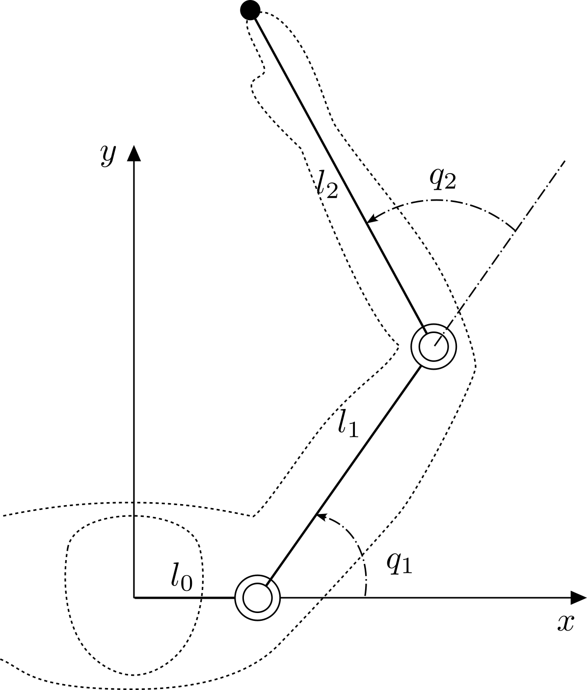

# Kinematics

Kinematics is the geometry of motion: it relates the joint angles of an arm to the
position of its endpoint, without yet asking what forces produce that motion. Two
complementary questions arise:

- **Forward kinematics (FK)** — given the joint angles, where is the endpoint?
- **Inverse kinematics (IK)** — given a desired endpoint, what joint angles reach it?

We develop both for the planar two-joint arm below, which is the running example
throughout the reference and the smallest case in which inverse kinematics already
shows its characteristic features (multiple solutions, a limited reach).

{ width="320" style="display: block; margin: 0 auto;" }

*A two-joint arm. The fixed base link $l_0$ offsets the first joint along the
$x$-axis; $q_1$ is measured from the $x$-axis and $q_2$ between the two links.*

Symbols used throughout the reference:

- $q_i$ — joint angle of joint $i$, relative to the previous link.
- $\theta_i = \theta_{i-1} + q_i$ — absolute angle of link $i$ from the $x$-axis.
- $l_i$ — length of link $i$, with $l_0$ the fixed base link.
- $(x_i, y_i)$ — position of the tip of link $i$ (the origin of joint $i+1$).

## 1. Forward kinematics

The base link is rigid and lies along the $x$-axis, so the first joint sits at
$(l_0, 0)$. Each subsequent link adds its own vector, rotated by the link's
absolute angle. For the two-joint arm, with $\theta_1 = q_1$ and
$\theta_2 = q_1 + q_2$, the endpoint $(x, y)$ is the sum of the base offset and the
two link vectors:

$$
\begin{aligned}
x &= l_0 + l_1 \cos q_1 + l_2 \cos(q_1 + q_2) \\
y &= l_1 \sin q_1 + l_2 \sin(q_1 + q_2).
\end{aligned}
$$

This composition generalizes directly to $n$ links by accumulating one rotated
link vector per joint — the recursion that `compute_forward_kinematics`
evaluates.

## 2. Inverse kinematics (analytic, two joints)

Inverse kinematics runs the map backwards: given a target endpoint $(x, y)$, find
the joint angles that place the tip there. For the two-joint arm this has a
closed-form solution.

First remove the fixed base offset by working relative to the first joint,
$x' = x - l_0$, so that $(x', y)$ is the endpoint measured from joint 1. The
straight-line distance from joint 1 to the endpoint is
$r = \sqrt{x'^2 + y^2}$.

### Second joint

The two links and the line $r$ form a triangle, so the law of cosines fixes the
included angle, which is exactly $q_2$:

$$
r^2 = l_1^2 + l_2^2 + 2 l_1 l_2 \cos q_2
\quad\Longrightarrow\quad
\cos q_2 = \frac{x'^2 + y^2 - l_1^2 - l_2^2}{2 l_1 l_2}.
$$

Hence

$$
q_2 = \pm \arccos\!\left( \frac{x'^2 + y^2 - l_1^2 - l_2^2}{2 l_1 l_2} \right).
$$

The two signs are the familiar **elbow-up** and **elbow-down** postures — both
reach the same endpoint. A real solution exists only when the argument of
$\arccos$ lies in $[-1, 1]$, i.e. when the target is within reach,
$|l_1 - l_2| \le r \le l_1 + l_2$.

### First joint

With $q_2$ known, the endpoint equations become linear in $\cos q_1$ and
$\sin q_1$:

$$
\begin{aligned}
x' &= (l_1 + l_2 \cos q_2)\cos q_1 - (l_2 \sin q_2)\sin q_1 \\
y  &= (l_1 + l_2 \cos q_2)\sin q_1 + (l_2 \sin q_2)\cos q_1.
\end{aligned}
$$

These say that the vector $(x', y)$ is the vector $(l_1 + l_2 \cos q_2,\ l_2 \sin q_2)$
rotated by $q_1$. Subtracting the two angles gives

$$
q_1 = \operatorname{atan2}(y, x') - \operatorname{atan2}\!\big(l_2 \sin q_2,\ l_1 + l_2 \cos q_2\big).
$$

Each choice of sign for $q_2$ yields its own $q_1$, so the two-joint arm has (in
general) two distinct configurations for a reachable target.

!!! note "Beyond two joints"
    The clean closed form above is special to the two-joint arm. Arms with more
    joints are typically *redundant* — infinitely many configurations reach a
    given endpoint — and the inverse problem is then solved numerically, as
    sketched in [Numerical Inverse Kinematics](06_numerical_inverse_kinematics.md);
    this page deliberately stops at the analytic two-joint case.

## 3. Where this leads

Forward and inverse kinematics both describe the arm at a single instant. The
[next chapter](02_differential_kinematics.md) sets the configuration in motion:
it relates the **joint velocities** $\dot{q}$ to the endpoint velocity through the
Jacobian, and extends the same idea to acceleration.

!!! note "Base link as the zeroth link"
    Following the reference notes, the arm is modeled with an explicit fixed base
    link of length $l_0$. In `skelarm` it is `links[0]`, configurable through the
    `base_length` argument of `Skeleton` (or a `base_length` key under the
    `[skeleton]` table in a TOML config). The actuated links are `links[1:]`, so `num_links` counts the
    base plus the movable links while `num_joints` counts the actuated degrees of
    freedom. A "two-link arm" therefore holds three links in total.
