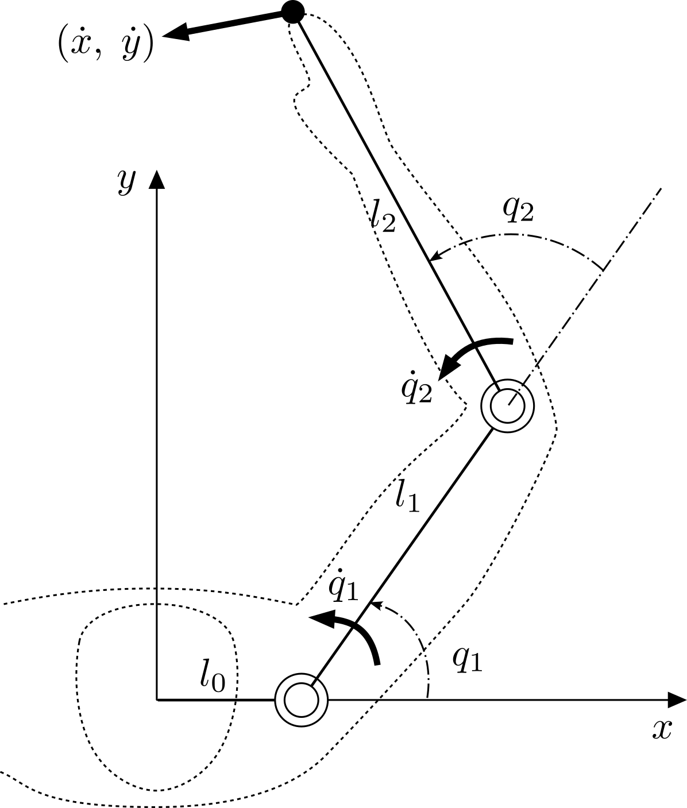

# Differential Kinematics

The [Kinematics](01_kinematics.md) chapter fixed the arm's configuration at a
single instant. Motion, however, is the variation of that configuration as time
passes. **Differential kinematics** studies the relationship between the *rates of
change* of the joint angles and the resulting endpoint velocity (and, one
derivative further, the endpoint acceleration).

This page builds the relationship up from a concrete two-joint arm and then
generalises it to an arbitrary number of joints, mirroring how the `skelarm`
kinematics code is organised.

## 1. A two-joint arm

Recall the two-joint arm from the [Kinematics](01_kinematics.md) chapter — a fixed
base link $l_0$ followed by two movable links of length $l_1$ and $l_2$. The figure
below revisits it, now with the joint velocities $\dot{q}_1, \dot{q}_2$ and the
resulting endpoint velocity drawn in.

{ width="320" style="display: block; margin: 0 auto;" }

*Endpoint velocity of a two-joint arm. The base link $l_0$ offsets the first
joint along the $x$-axis; $q_1, q_2$ are the joint angles and
$\dot{q}_1, \dot{q}_2$ their velocities.*

Its endpoint position is

$$
\begin{aligned}
x &= l_0 + l_1 \cos q_1 + l_2 \cos(q_1 + q_2) \\
y &= l_1 \sin q_1 + l_2 \sin(q_1 + q_2).
\end{aligned}
$$

Differentiating with respect to time relates the joint velocities to the endpoint
velocity at the current configuration:

$$
\begin{aligned}
\dot{x} &= -\dot{q}_1 l_1 \sin q_1 - (\dot{q}_1 + \dot{q}_2) l_2 \sin(q_1 + q_2) \\
\dot{y} &= \dot{q}_1 l_1 \cos q_1 + (\dot{q}_1 + \dot{q}_2) l_2 \cos(q_1 + q_2).
\end{aligned}
$$

Notice that the constant base length $l_0$ drops out of the velocity: it shifts
*where* the arm is but never *how fast* the endpoint moves.

## 2. Generalising to $n$ joints

Introduce the **absolute link angle** $\theta_i$ — the orientation of link $i$
measured from the $x$-axis — so that $\theta_i = \theta_{i-1} + q_i$. With this
notation the pattern above extends to an arm of $n$ movable links by a recursion
that sweeps **forward** from the base (link $0$) to the endpoint (link $n$).

Symbols used throughout:

- $q_i$ — joint angle of joint $i$, relative to the previous link.
- $\theta_i$ — absolute angle of link $i$.
- $(x_i, y_i)$ — position of the tip of link $i$ (equivalently, the origin of
  joint $i+1$).
- $l_i$ — length of link $i$, with $l_0$ the fixed base link.

### Velocity

The base link is rigid, so the base of the chain starts from rest:

$$
\dot{\theta}_0 = 0, \qquad \dot{x}_0 = 0, \qquad \dot{y}_0 = 0.
$$

(The base length still enters the *positions* through $x_0 = l_0$, $y_0 = 0$, but
not the velocities.) For $i = 1, \dots, n$:

$$
\begin{aligned}
\dot{\theta}_i &= \dot{\theta}_{i-1} + \dot{q}_i \\
\dot{x}_i &= \dot{x}_{i-1} - \dot{\theta}_i\, l_i \sin \theta_i \\
\dot{y}_i &= \dot{y}_{i-1} + \dot{\theta}_i\, l_i \cos \theta_i.
\end{aligned}
$$

Running the recursion to $i = n$ yields the endpoint velocity.

### Acceleration

Differentiating once more gives the matching acceleration recursion, again with
$\ddot{\theta}_0 = \ddot{x}_0 = \ddot{y}_0 = 0$ and, for $i = 1, \dots, n$:

$$
\begin{aligned}
\ddot{\theta}_i &= \ddot{\theta}_{i-1} + \ddot{q}_i \\
\ddot{x}_i &= \ddot{x}_{i-1} - \dot{\theta}_i^2\, l_i \cos \theta_i - \ddot{\theta}_i\, l_i \sin \theta_i \\
\ddot{y}_i &= \ddot{y}_{i-1} - \dot{\theta}_i^2\, l_i \sin \theta_i + \ddot{\theta}_i\, l_i \cos \theta_i.
\end{aligned}
$$

These two recursions are exactly what `compute_forward_kinematics` evaluates as
it walks the link list; the fixed base link (stored as `links[0]`) simply
contributes its $l_0$ offset with zero velocity and acceleration.

## 3. The Jacobian

The endpoint velocity is *linear* in the joint velocities, so it can be packed into a
matrix–vector product. Writing the endpoint as $(x, y) \equiv (x_n, y_n)$,

$$
\begin{bmatrix} \dot{x} \\ \dot{y} \end{bmatrix}
= J \dot{q}
= \begin{bmatrix} j_{x1} & \cdots & j_{xn} \\ j_{y1} & \cdots & j_{yn} \end{bmatrix}
\begin{bmatrix} \dot{q}_1 \\ \vdots \\ \dot{q}_n \end{bmatrix},
\qquad
\dot{x} = \sum_{i=1}^{n} j_{xi}\, \dot{q}_i, \quad
\dot{y} = \sum_{i=1}^{n} j_{yi}\, \dot{q}_i.
$$

The columns $j_{xi}, j_{yi}$ are the **Jacobian basis** for joint $i$. They can
be assembled by a **backward** recursion (from the tip down to joint $1$, with a
virtual zero column at $n+1$):

$$
j_{x(n+1)} = 0, \quad j_{xi} = j_{x(i+1)} - l_i \sin \theta_i, \qquad
j_{y(n+1)} = 0, \quad j_{yi} = j_{y(i+1)} + l_i \cos \theta_i.
$$

Equivalently — and this is the compact form `skelarm` uses — each column is the
lever arm from joint $i$ to the endpoint, rotated by a quarter turn:

$$
j_{xi} = -(y_n - y_{i-1}), \qquad j_{yi} = x_n - x_{i-1},
$$

where $(x_{i-1}, y_{i-1})$ is the origin of joint $i$. The two expressions agree,
and both equal the partial derivatives of the endpoint position,

$$
j_{xi} = \frac{\partial x}{\partial q_i}, \qquad j_{yi} = \frac{\partial y}{\partial q_i},
$$

which is precisely why $J = \partial (x, y) / \partial (q_1, \dots, q_n)$.

## 4. Centripetal and Coriolis basis

Differentiating the Jacobian relation extends the idea to acceleration:

$$
\begin{aligned}
\ddot{x} &= \sum_{i=1}^{n} \left( j_{xi}\, \ddot{q}_i + h_{xi}\, \dot{q}_i \right) \\
\ddot{y} &= \sum_{i=1}^{n} \left( j_{yi}\, \ddot{q}_i + h_{yi}\, \dot{q}_i \right),
\end{aligned}
$$

where $h_{xi}, h_{yi}$ are the time derivatives of the Jacobian columns,
$h_{xi} = \dot{j}_{xi}$ and $h_{yi} = \dot{j}_{yi}$. The products $h_{\ast i}\dot{q}_i$
are the centripetal and Coriolis accelerations, so $h_{\ast i}$ is called the
**centripetal/Coriolis basis**. Geometrically it is the velocity counterpart of
the Jacobian column,

$$
h_{xi} = -(\dot{y}_n - \dot{y}_{i-1}), \qquad h_{yi} = \dot{x}_n - \dot{x}_{i-1},
$$

with $(\dot{x}_{i-1}, \dot{y}_{i-1})$ the velocity of joint $i$'s origin.

## 5. Implementation

The differential-kinematics helpers in `skelarm.kinematics` make these two
viewpoints — the forward recursion and the Jacobian/basis form — independently
computable, which is exactly what lets one validate the other.

| Function | Returns | Theory |
| --- | --- | --- |
| `compute_forward_kinematics` | (updates link state) | Sections 2; forward velocity/acceleration recursion |
| `compute_jacobian` | $2 \times n$ matrix $J$ | Section 3 |
| `compute_coriolis_basis` | $2 \times n$ matrix $H$ | Section 4 |
| `compute_endpoint_velocity` | $J \dot{q}$ | Section 3 |
| `compute_endpoint_acceleration` | $J \ddot{q} + H \dot{q}$ | Section 4 |

The Jacobian helpers read the joint and endpoint state populated by
`compute_forward_kinematics`, so call it first. Because the endpoint velocity and
acceleration are then available from **two** routes — propagated directly by the
forward recursion (stored on the tip link as `vx, vy, ax, ay`) and reconstructed
from the Jacobian and basis — comparing them is a built-in consistency check:

```python
import numpy as np
from skelarm import (
    Skeleton, LinkProp,
    compute_forward_kinematics,
    compute_endpoint_velocity, compute_endpoint_acceleration,
)

skeleton = Skeleton(
    [LinkProp(length=1.0, m=1.0, i=0.1, rgx=0.5, rgy=0.0, qmin=-np.pi, qmax=np.pi),
     LinkProp(length=0.8, m=1.0, i=0.1, rgx=0.4, rgy=0.0, qmin=-np.pi, qmax=np.pi)],
    base_length=0.3,
)
skeleton.q = np.array([0.4, -0.7])
skeleton.dq = np.array([0.8, 0.3])
skeleton.ddq = np.array([0.6, -0.4])

compute_forward_kinematics(skeleton)
tip = skeleton.links[-1]

assert np.allclose(compute_endpoint_velocity(skeleton), [tip.vx, tip.vy])
assert np.allclose(compute_endpoint_acceleration(skeleton), [tip.ax, tip.ay])
```

The base link is set up in the [Kinematics](01_kinematics.md) chapter; here it
contributes only a constant offset, since a fixed link has no velocity.
